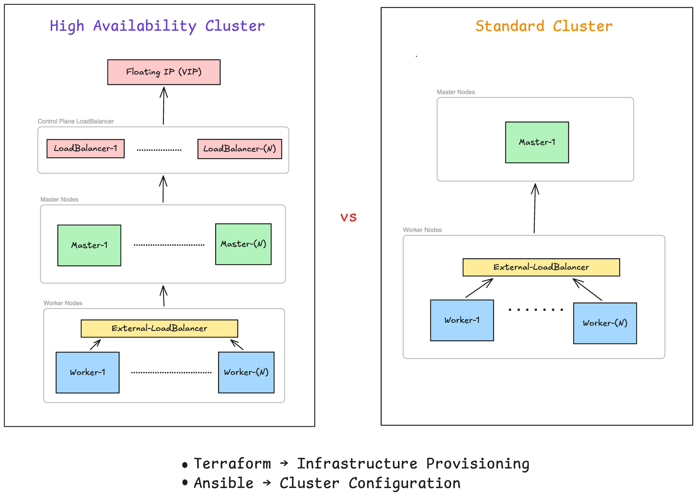

# terraform-ansible-kubernetes-ha

Production-style Kubernetes cluster automation using Terraform, Ansible, kubeadm, HAProxy, Keepalived, MetalLB, NGINX Gateway Fabric, and Prometheus.

This project supports:

- Standard Kubernetes Cluster deployment
- Highly Available (HA) Kubernetes Cluster deployment
- Standard → HA cluster upgrade
- HA → Standard cluster downgrade

Built for infrastructure automation, Kubernetes operations, DevOps learning, and production-style cluster lifecycle management.

---

# Architecture

## Kubernetes Clusters

---

# Demo Screenshots

## Cluster Nodes

---

## HA Failover Testing

---

## MetalLB External IP

---

## Prometheus Monitoring

---

# Demo Videos

- [Deploying Standard vs HA Kubernetes Clusters](YOUR_VIDEO_LINK)
- [Upgrading Standard Cluster to HA Cluster](YOUR_VIDEO_LINK)
- [HA Cluster Failure Testing](YOUR_VIDEO_LINK)

---

# Key Features

## Kubernetes Cluster Automation
- Automated Kubernetes installation using kubeadm
- Standard and Highly Available cluster topologies
- Automated control plane and worker node joining
- Containerd runtime configuration
- Calico CNI networking

## Infrastructure as Code
- Terraform-based VM provisioning
- Multipass virtualization
- Dynamic inventory generation

## High Availability
- HAProxy API load balancing
- Keepalived Virtual IP (VIP) failover
- Multi-control-plane Kubernetes architecture
- Control plane fault tolerance

## Cluster Lifecycle Management
- Deploy standard Kubernetes clusters
- Deploy HA Kubernetes clusters
- Upgrade standard clusters to HA
- Downgrade HA clusters to standard topology
- Dynamic infrastructure reconfiguration

## Networking & Gateway
- MetalLB LoadBalancer integration
- Gateway API CRDs
- NGINX Gateway Fabric
- External service exposure

## Observability & Monitoring
- Prometheus monitoring stack
- Kubernetes metrics collection
- Node and cluster monitoring
- Resource usage visibility

## DevOps Practices
- Modular Ansible roles
- Idempotent automation
- Reusable playbooks
- Infrastructure reproducibility
  
---

# Documentation

Detailed setup and operational guides:

- [Standard Cluster Installation](docs/installation/standard-cluster.md)
- [HA Cluster Installation](docs/installation/ha-cluster.md)
- [Upgrade Standard Cluster to HA](docs/installation/upgrade-standard-to-ha.md)
- [Downgrade HA Cluster to Standard](docs/installation/downgrade-ha-to-standard.md)
- [Prometheus Monitoring Setup](docs/monitoring/prometheus.md)
- [Troubleshooting Guide](docs/troubleshooting/)

---

# Tech Stack

| Category | Technology |
|---|---|
| Infrastructure Provisioning | Terraform |
| Configuration Management | Ansible |
| Kubernetes Bootstrap | kubeadm |
| Container Runtime | containerd |
| Virtualization | Multipass |
| Networking | Calico |
| HA Load Balancing | HAProxy |
| VIP Failover | Keepalived |
| LoadBalancer | MetalLB |
| Gateway | NGINX Gateway Fabric |
| Monitoring | Prometheus |
  
---
# Future Improvements

- Grafana dashboard integration
- Alertmanager integration
- ArgoCD GitOps deployment
- cert-manager TLS automation
- External DNS support
- CSI storage integration
- CI/CD pipeline integration
- Automated cluster scaling and node management
- Multi-cluster environment support
- Proxmox-based Kubernetes infrastructure provisioning using Type-1 hypervisor architecture
- Extend the cluster into a unified AI/ML platform supporting:
  - distributed model training
  - data engineering pipelines
  - experiment tracking
  - scalable inference workloads
  - collaborative MLOps workflows
 
---

# Author

## Naresh Jung Shahi

Researcher | Machine Learning Engineer | Kubernetes & DevOps Enthusiast |  

- LinkedIn: https://www.linkedin.com/in/naresh-jung-shahi-0b2543223/

---

# License

MIT License
